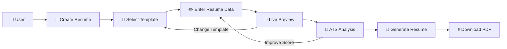
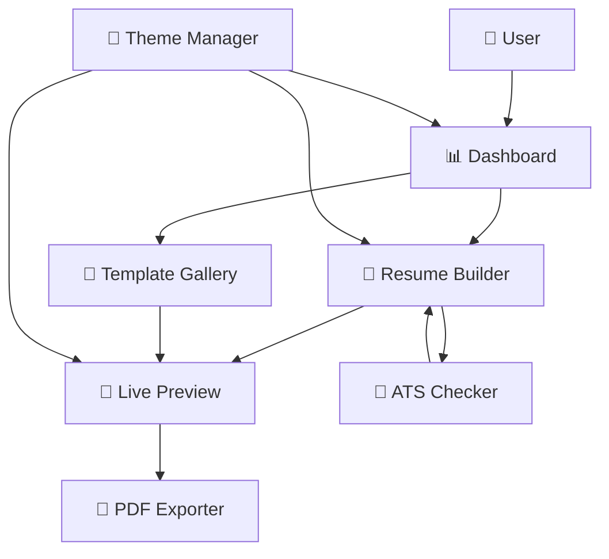
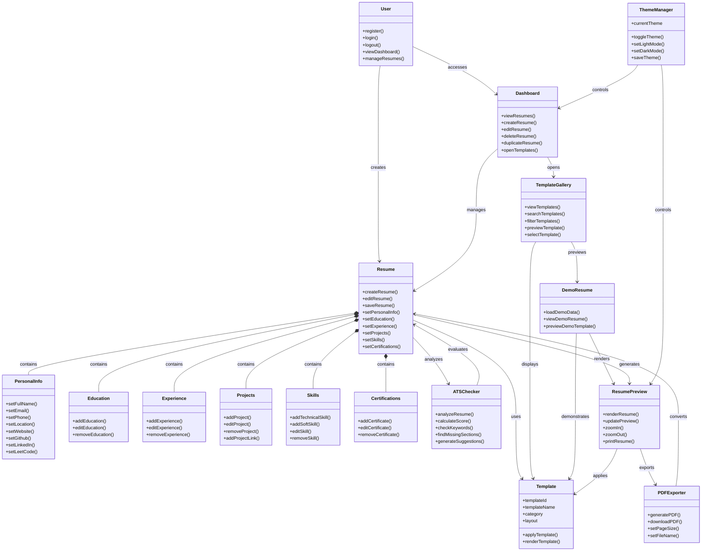
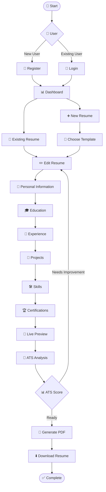
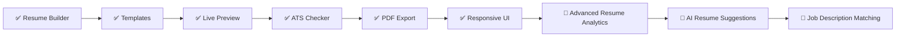

<div align="center">

# 🚀 Resume Craft

### Professional • ATS-Friendly • Modern Resume Builder

Create **clean, professional, and ATS-friendly resumes** with modern templates, live preview, ATS analysis, and high-quality PDF export.

<p>
  <a href="https://resume-craft-07.vercel.app/">
    
  </a>
  <a href="https://github.com/SurajRawatr07/RESUME-BUILDER-WEBSITE">
    
  </a>
</p>

<p>
  
  
  
  
  
</p>

</div>

---

## ✨ Overview

**Resume Craft** is a modern web-based resume builder designed for students, developers, freshers, and professionals who want to create polished and ATS-friendly resumes without dealing with complicated document formatting.

The platform provides a structured resume editor, professional templates, real-time preview, ATS analysis, theme support, and PDF export in a single workflow.

---

## 🎯 Why Resume Craft?

- 📝 Build resumes section by section
- 🎨 Choose from professional resume templates
- 👀 Preview changes in real time
- 🤖 Analyze resumes for ATS compatibility
- 📄 Export resumes as PDF
- 🔗 Add clickable professional links
- 🌙 Switch between Light and Dark themes
- 📱 Use the application across desktop, tablet, and mobile
- ⚡ Fast and responsive editing experience

---

## 🚀 Features

| Feature | Description |
|---|---|
| 📄 Resume Builder | Create and edit structured resumes |
| 🎨 Professional Templates | Multiple modern and ATS-friendly layouts |
| 👀 Live Preview | Instantly preview resume changes |
| 🤖 ATS Checker | Analyze resume structure, keywords, and ATS score |
| 📥 PDF Export | Generate and download a professional PDF |
| 🔗 Social Links | Add GitHub, LinkedIn, Portfolio, Email, Phone, and LeetCode |
| 🎓 Education Section | Add multiple education records |
| 💼 Experience Section | Manage internships and professional experience |
| 🚀 Projects Section | Showcase projects with technology and links |
| 🛠️ Skills Section | Organize technical and professional skills |
| 🏆 Certifications | Add certificates and credential links |
| 📊 Dashboard | Manage created resumes from one place |
| 🌙 Theme System | Smooth Light / Dark mode |
| 📱 Responsive Design | Optimized for mobile, tablet, and desktop |
| ✨ Modern UI | Clean interface with subtle animations |

---

## 🧩 How Resume Craft Works



---

## 🏗️ System Architecture



---

## 📐 Resume Craft Class Diagram



---

## 🛠️ Tech Stack

### Frontend

- **React 18+**
- **TypeScript**
- **Vite**
- **Tailwind CSS**
- **Framer Motion**
- **Lucide React**

### Core Functionality

- Resume data management
- Dynamic template rendering
- Real-time resume preview
- ATS score analysis
- PDF generation
- Responsive design
- Theme management

---

## 📂 Project Structure

```text
Resume-Craft/
│
├── public/
│   ├── assets/
│   └── ...
│
├── src/
│   ├── components/
│   │   ├── resume/
│   │   ├── templates/
│   │   ├── dashboard/
│   │   ├── ats/
│   │   └── ui/
│   │
│   ├── pages/
│   ├── hooks/
│   ├── lib/
│   ├── types/
│   ├── data/
│   ├── App.tsx
│   └── main.tsx
│
├── package.json
├── tailwind.config.js
├── tsconfig.json
└── README.md
```

---

## ⚙️ Getting Started

### 1. Clone the repository

```bash
git clone https://github.com/SurajRawatr07/RESUME-BUILDER-WEBSITE.git
```

### 2. Navigate to the project

```bash
cd RESUME-BUILDER-WEBSITE
```

### 3. Install dependencies

```bash
npm install
```

### 4. Start development server

```bash
npm run dev
```

### 5. Open in browser

```text
http://localhost:5173
```

---

## 🎨 Design Philosophy

Resume Craft follows a clean and professional visual language focused on readability and usability.

### Design Principles

- Minimal and professional interface
- Strong typography hierarchy
- ATS-friendly resume layouts
- Consistent spacing
- Responsive components
- Subtle motion and micro-interactions
- Light and Dark theme support
- No unnecessary visual clutter

---

## 📱 Responsive Experience

Resume Craft is designed to work across:

```text
📱 Mobile
   ↓
📲 Tablet
   ↓
💻 Laptop
   ↓
🖥️ Desktop
```

The interface adapts navigation, forms, template previews, cards, and resume layouts according to screen size.

---

## 🔄 Application Flow



---

## 📈 Development Roadmap



---

## 🔮 Future Improvements

- 🤖 AI-powered resume improvement
- 🎯 Job description keyword matching
- 📊 Advanced ATS analytics
- ✨ More professional templates
- 📄 Multiple export formats
- 🔗 Public resume sharing
- 📈 Resume performance insights
- ☁️ Cloud resume storage
- 👥 Resume collaboration
- 🌐 Custom resume URLs

---

## 🌐 Live Project

<p align="center">

<a href="https://resume-craft-07.vercel.app/">
  
</a>

</p>

---

## 👨‍💻 Author

<div align="center">

### Suraj Rawat

**BCA Computer Science Student · MERN Stack Developer · Open Source Contributor**

<p>
  <a href="https://github.com/SurajRawatr07">
    
  </a>
  <a href="https://www.linkedin.com/in/suraj-rawat-30513b340/">
    
  </a>
</p>

</div>

---

## ⭐ Support

If you find **Resume Craft** useful, consider giving the repository a ⭐ on GitHub.

Your support helps improve the project and motivates further development.

---

<div align="center">

### 🚀 Resume Craft

**Build a better resume. Build a better career.**

Made with ❤️ by **Suraj Rawat**

</div>
